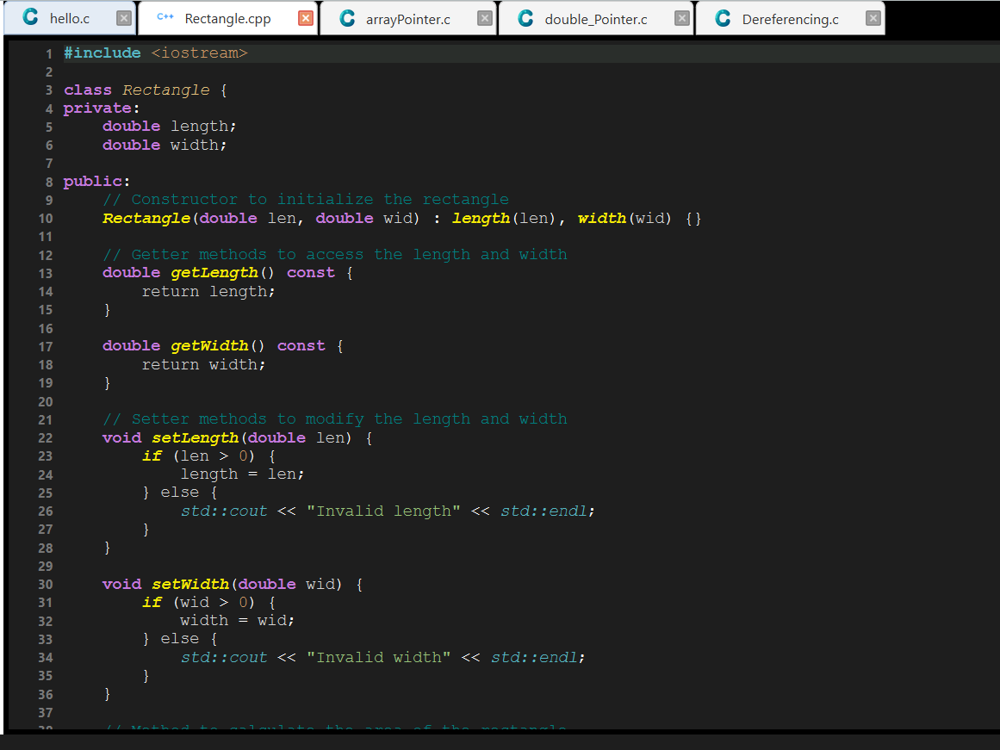
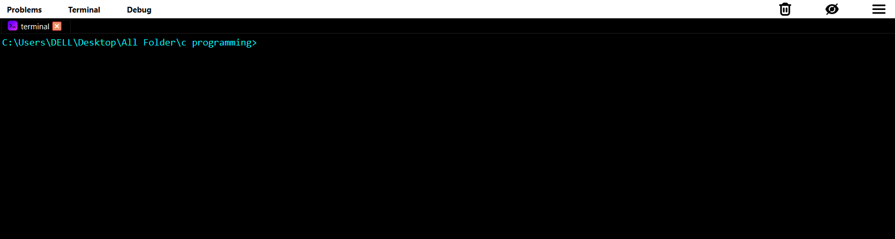
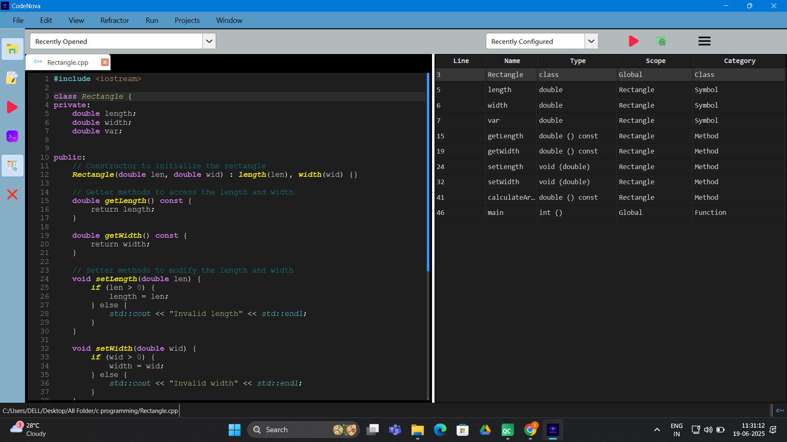

# 🚀 CodeNova - A Modern Multilingual Code Editor

Welcome to **CodeNova**, a sleek, lightweight, and powerful **C/C++/Python code editor** built with **Qt 6** and designed for productivity, readability, and real-time assistance. Perfect for students, professionals, and educators.

 <!-- Optional logo -->

---

## ✨ Features

- 🎨 **Dark Theme UI** with modern font rendering
- 🧠 **Syntax Highlighting** for C, C++, Python
- 🛠️ **Real-time Compilation & Execution**
- 🧩 **Clangd + LSP Integration** for autocompletion, diagnostics, go-to-definition
- 📜 **Symbol Table Generator** (for C/C++)
- 🔍 **Search Overview Panel** (cross-file symbol/keyword search)
- 🧮 **Terminal Emulator** with real-time input/output
- ✍️ **Live Error Underlining**
- 🧘 **Zen Mode** for distraction-free coding
- 📂 **Multi-tab Editor** with lock/close tab control

---

## 📸 Screenshots

> *(Add screenshots in `docs/screenshots/` and update these links)*

| Editor View | Terminal View | Symbol Table |
|-------------|---------------|--------------|
|  |  |  |

---

## 🔧 Installation

### 📦 Prerequisites

- Qt 6.5 or higher
- CMake (if using CMake build)
- Clangd (for LSP)
- Python 3 (optional for Python execution)
- MinGW 64-bit (for C/C++ compilation on Windows)

### 🚀 Build Instructions (Qt Creator)

1. Clone the repo:
    ```bash
    git clone https://github.com/YourUsername/CodeNova.git
    cd CodeNova
    ```

2. Open the `.pro` file in **Qt Creator**

3. Configure a Kit (Desktop Qt 6.x with MinGW or MSVC)

4. Build & Run!

> 📝 If you’re using **CMake**:
> ```bash
> mkdir build
> cd build
> cmake ..
> cmake --build .
> ```

---

## ⚙️ Configuration

To set up **Clangd**:

1. Install it from [https://clangd.llvm.org](https://clangd.llvm.org)
2. Add to system PATH
3. Editor will auto-detect it on launch

To set up **MinGW**:

- Download from [https://winlibs.com/](https://winlibs.com/)
- Add `bin/` path to `System Environment Variables` > `Path`

---

## 💡 How It Works

- **Symbol Table**: Lexical analysis is performed on your code using custom token parsers.
- **LSP Client**: Communicates via JSON-RPC with Clangd to offer smart features.
- **Terminal Emulator**: Subclass of `QPlainTextEdit` handling real-time I/O streams.
- **Code Highlighters**: Custom `QSyntaxHighlighter` subclasses for each language.

---

## 🧪 Sample Code Supported

### C
```c
int main() {
    printf("Hello, CodeNova!");
    return 0;
}
